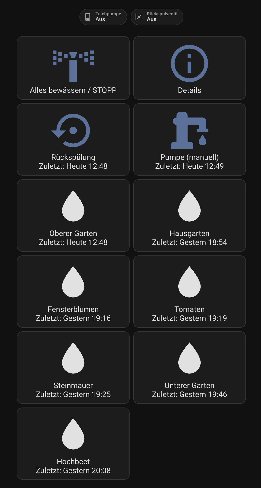
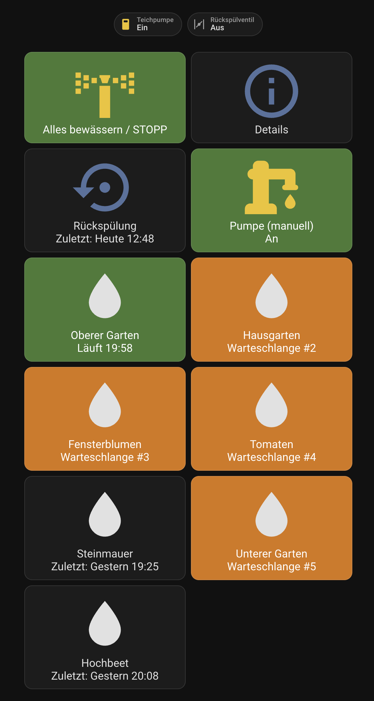

<div align="center">
  

# Automated Garden Watering — Home Assistant Custom Integration

</div>

A Home Assistant integration for garden irrigation with a queue-based watering controller, well pump and backwash valve coordination, automatic mid-cycle and end-of-cycle backwash, a daily timer, and a global watering multiplier.

What sets it apart from other irrigation integrations: a **two-stage, interval-driven backwash** — a pump-off reverse-flow pass followed by a pump-on flush — that triggers automatically every N minutes of cumulative watering during long runs (and at end-of-queue when warranted). The reverse-flow stage lets stored pressure push water backwards through the filter to dislodge dirt, then the flush stage carries it away. The result is a filter that stays a lot cleaner than a single open-valve pulse.

| [](images/screenshot_01.png) | [](images/screenshot_02.png) |
|:---:|:---:|
| Idle — every zone shows when it last watered. Click any zone to queue and automatically water it. | *Water all* clicked and then two zones manually dequeued: green running, orange queued, gray dequeued. |

## Features

- Works on top of any existing Home Assistant `switch` entities (pump, backwash valve, zone valves).
- UI config flow + options flow (everything is editable later).
- Queue model: zones queue back-to-back; low-flow zones can opt into
  **parallel execution** via a per-zone `max_parallel` setting (default 1).
- "Water all" runs every zone in your configured run order.
- Pump is always turned on first, with configurable pressure build-up delay.
- Two-stage backwash (pump-off reverse flow + pump-on flush) for a much deeper filter clean; triggered manually at any time, automatically every N minutes of active watering, and at end-of-queue when the run was long enough or was started by the timer.
- Global watering duration multiplier (e.g. `2.5` = water 2.5× longer than the per-zone default).
- Daily start timer with on/off switch.
- Status sensor & queue sensor for dashboards.
- UI available in English and German.

## Installation (HACS)

1. In HACS → Integrations → ⋮ → *Custom repositories*, add this repo's URL with category *Integration*.
2. Install **Automated Garden Watering**.
3. Restart Home Assistant.
4. *Settings → Devices & Services → Add Integration → Automated Garden Watering*.

## Configuration

The setup flow asks for the pump and backwash switch (both optional), and at least one zone. After setup, use *Configure* on the integration card to:

- Add / remove / reorder zones (each: switch entity, display name, default duration, run order). Delete a zone from inside its edit screen (tick *Delete this zone*).
- Adjust the pump/backwash delays, the backwash reverse-flow and flush times, automatic backwash interval and end-of-queue threshold.

The **watering multiplier**, **daily start time** and **daily timer** are *not*
in the config dialog — they have their own entities (`number` / `time` /
`switch`) so you set them directly from the dashboard. Their values persist
across restarts. This keeps each setting in exactly one place.

### Parallel zones (`max_parallel`)

Each zone has a `max_parallel` value (default 1). When zones are queued one
after another, the controller forms a **group**: it walks the queue head and
pulls zones in as long as each candidate's `max_parallel` is ≥ the current
group size. The group's effective cap is the lowest `max_parallel` among its
members. All zones in a group water in parallel; once they drain, the next
group forms.

Example queue (max_parallel in parentheses):

| Queue | Active group | Why |
|---|---|---|
| `A(1), B(2), C(3), D(2), E(3), F(3)` | A alone | A's cap is 1 |
| → after A finishes | B + C | cap = min(2, 3) = 2 |
| → after B+C finish | D + E | cap = min(2, 3) = 2 |
| → after D+E finish | F alone | nothing left to join |

**Refill on early finish.** If a zone in a group finishes earlier than its
peers, the next queued zone is promoted into the now-free slot as long as the
group cap and the candidate's own `max_parallel` both allow it. Otherwise the
group keeps draining and a fresh group forms only when *all* current zones
have ended.

**Backwash** pauses every active zone (snapshot of remaining seconds preserved
in `paused`), runs the two-stage wash, then re-opens all paused valves and
resumes the countdown where it left off.

**Adjacency matters — zones only group with their queue neighbors.** Group
formation walks the queue head outward and stops at the first zone that
doesn't fit; it never skips over a queued zone. So in `[A(2), B(1), C(2)]`,
A always runs alone — C is never pulled into A's group, even though
they would happily run together.

**Tap behavior.** Tapping a zone button always appends it to the queue tail.
The same refill logic then decides whether it can immediately join the
running group — which it can only if (a) the group has slack *and* (b) the
queue head fits. A zone already waiting in the queue is never bypassed by a
later tap. (If you want zone X to run in parallel with what's running now,
make sure nothing else is queued ahead of X.)

Set `max_parallel = 1` for high-flow zones (lawn sprinklers) that should never
share the pump. Raise it for low-flow drip lines or small sprinklers that
together still stay within the pump's flow rate.

### Backwash sequence

Backwash runs a pump-off reverse-flow stage followed by a pump-on flush, which
cleans the filter far better than just opening the valve:

1. Close all zone valves.
2. **Pressure build-up** — pump on, wait *Backwash pressure build-up delay*.
3. **Reverse flow** — turn the pump **off**, open the backwash valve, wait
   *Backwash reverse-flow time*. With the pump off, the stored pressure pushes
   water backwards through the filter and dislodges the dirt (the pump would
   otherwise fight that reverse flow).
4. **Flush** — turn the pump back **on** (valve still open), wait *Backwash
   flush time* to flush the dislodged dirt out.
5. Close the backwash valve, then resume watering or, if nothing remains, turn
   the pump off.

## Entities

| Entity | Description |
|---|---|
| `button.automated_garden_watering_water_all` | Run all zones in order; pressing again while queue is active = emergency stop. Attribute `running` for coloring. |
| `button.automated_garden_watering_backwash` | Immediate backwash (never queued). Attributes `status` (`running`/`idle`) for coloring and `last_run` / `last_run_friendly` for showing when it last ran (persisted across restarts). |
| `button.automated_garden_watering_zone_<order>` | Toggle that zone in the queue (press to add, press again to remove/stop). The `<order>` suffix is the zone's run order, so the buttons sort naturally in the UI. The friendly zone name set during setup is the entity's display name and is also in the `zone_name` attribute. Attributes `last_run` (ISO) and `last_run_friendly` (e.g. `Today 14:30`, `Yesterday 09:00`, `Mon 09:00`, `May 03`) record when the zone last watered (persisted across restarts). |
| `switch.automated_garden_watering_pump_manual` | Manual well-pump control for e.g. a garden hose (only created if a pump is configured). Turning it **off** is blocked while a queue/backwash is active so the pump-first safety rule can't be broken manually. Attributes `status`, `last_run`, `last_run_friendly`, `controlled_by` (`manual`/`automation`) — so it can be shown as a button with a last-run line like the zones. |
| `button.automated_garden_watering_dashboard_yaml` | Config button (display name *Dashboard YAML*): generates a complete dashboard YAML for your exact entities/zones and shows it in a notification you can copy from. |
| `number.automated_garden_watering_watering_multiplier` | Global watering multiplier. |
| `time.automated_garden_watering_daily_start_time` | Daily start time. |
| `switch.automated_garden_watering_daily_timer` | Enable/disable the daily timer. |
| `switch.automated_garden_watering_show_details` | UI-only toggle (no effect on irrigation). The dashboard's *Details* button toggles it, and a `conditional` card reveals the status/timer/multiplier list while it's on. State is remembered across restarts. |
| `sensor.automated_garden_watering_status` | `idle`, `pump_pressure`, `watering`, `backwash_pressure`, `backwash` (reverse flow, pump off), `backwash_flush` (pump on). Slow-changing attributes only (queue, active zone, multiplier) so it doesn't flood the recorder. |
| `sensor.automated_garden_watering_active_zone` | Currently watering zone name (or `none`). |
| `sensor.automated_garden_watering_queue` | Comma-separated upcoming zones. |
| `sensor.automated_garden_watering_current_step_time_remaining` | Countdown (`H:MM:SS`) for the active zone, or the backwash while it runs. Attributes: `hours`, `minutes`, `seconds`, `total_seconds`, `phase`, `label`. Updates every second — see *Database / recorder* below. |
| `sensor.automated_garden_watering_queue_time_remaining` | Countdown (`H:MM:SS`) of all remaining watering in the queue. Pauses (holds steady) during backwash. Attributes: `hours`, `minutes`, `seconds`, `total_seconds`. Updates every second — see *Database / recorder* below. |

## Database / recorder

The two `*_time_remaining` sensors are live countdowns: their state changes every
second while irrigation is running, which would write a lot of rows to the
recorder database. (The other sensors only change on real transitions, so they
are fine to keep.)

Recording these countdowns has little value, so exclude them. Add this to your
`configuration.yaml` (merge with any existing `recorder:` block) and restart:

```yaml
recorder:
  exclude:
    entity_globs:
      # Live irrigation countdowns — change every second, no value in history.
      - sensor.*_time_remaining
```

If you renamed the integration's device, the entity_id prefix differs; the glob
above still matches because it keys off the `_time_remaining` suffix. To be more
specific instead, use `sensor.automated_garden_watering_*_time_remaining` (adjust the
prefix to your device name).

## Safety

- The pump is always turned on before any **zone** valve opens.
- Only one zone valve is ever open at a time.
- No zone runs during backwash.
- On stop / completion, all valves and the pump are closed.

> Note: the backwash *reverse-flow* stage intentionally runs with the pump
> **off** while the backwash valve is open — this is required so water can flow
> backwards through the filter. This is the one deliberate exception to
> "pump on before a valve opens", and it only applies to the backwash valve,
> never to zone valves.

## Actions (service calls)

The integration registers four service actions. Calling them from automations
is equivalent to pressing the matching button (with looser ergonomics, e.g.
by zone name instead of entity_id).

| Service | Fields | Behavior |
|---|---|---|
| `automated_garden_watering.water_all` | — | Queue every zone in run order. Calling it again while a queue is active stops the queue (emergency stop). |
| `automated_garden_watering.stop` | — | Stop the queue and close all valves. No-op when idle. |
| `automated_garden_watering.backwash` | — | Trigger an immediate two-stage backwash. Raises an error if no backwash valve is configured. |
| `automated_garden_watering.water_zone` | `zone` (required) | Queue or dequeue one zone by display name (case-insensitive), zone id, or its valve `switch.*` entity_id. |

Errors are surfaced as `ServiceValidationError` with translated messages: e.g.
unknown zone, no backwash valve configured, or the integration not yet set up.

## Use cases

- **Stagger morning watering** — pair the daily timer with the watering
  multiplier to vary total run time by season: a higher number entity value
  during summer, a lower one in shoulder seasons. Multiplier and timer have
  their own entities, so an automation can write to them directly.
- **Rain skip** — feed a rain sensor into an automation that flips
  `switch.<…>_daily_timer` off for the day (and back on the next morning).
- **Hose-only operation** — if you have no zone valves but want pump
  coordination, leave zones empty and just use the manual pump switch.
- **Filter-friendly long runs** — for orchards or long rows, set
  `backwash_interval` to a few minutes so the filter is cleaned mid-cycle
  rather than only at the end.

## Example automations

```yaml
# Skip today's daily run if it rained overnight.
automation:
  - alias: "Garden — skip daily watering after rain"
    triggers:
      - trigger: time
        at: "05:55:00"
    conditions:
      - condition: numeric_state
        entity_id: sensor.rain_last_24h_mm
        above: 2
    actions:
      - action: switch.turn_off
        target:
          entity_id: switch.automated_garden_watering_daily_timer
```

```yaml
# Water a single zone by display name on demand.
script:
  water_front_lawn:
    sequence:
      - action: automated_garden_watering.water_zone
        data:
          zone: "Front lawn"
```

## Data updates

The integration is fully event-driven — no polling. The coordinator runs an
internal 1-second tick that advances the state machine and pushes updates to
entities via the HA dispatcher. The recorder-heavy countdown sensors should be
excluded from history as described in *Database / recorder* above.

## Known limitations

- Only one config entry (one controller device) per Home Assistant instance.
  This is intentional: the daily timer, manual pump rules, and "Water all" all
  assume a single shared pump/backwash circuit.
- The state machine ticks once per second; phase durations are integer seconds.
  Sub-second timing is not supported.
- If a configured switch entity is renamed or removed, the corresponding zone
  button becomes unavailable; reopen the integration's *Configure* dialog to
  pick a new switch.
- The dashboard YAML generator targets the current set of entities and devices
  at the time you press the button — paste it again after adding or removing
  zones.

## Troubleshooting

- **A zone doesn't run.** Open Developer Tools → States and verify the zone's
  `switch.*` entity exists and toggles when called manually. If it doesn't, the
  zone button will show as unavailable and a repair issue is raised under
  *Settings → System → Repairs*.
- **Changing pump or backwash switch.** Use *Settings → Devices & Services →
  Automated Garden Watering → Reconfigure*. Zones stay in *Configure → Zones*.
- **Pump won't turn off.** Manual pump-off is intentionally refused while a
  queue or backwash is running. Press *Water all* (or call
  `automated_garden_watering.stop`) to abort, then the pump can be turned off.
- **Daily timer fired at the wrong time.** Home Assistant's timezone setting
  controls when the `time` entity fires; check *Settings → System → General*.
- **Backwash button missing.** It only appears when a backwash valve was
  selected during setup. Add one via *Configure → Global settings*.
- **Need more detail for a bug report?** Open the integration in
  *Settings → Devices & Services*, click the three-dot menu, and choose
  *Download diagnostics* — the dump includes the coordinator state, queue,
  and (redacted) configured switch entities.

## Removal

1. *Settings → Devices & Services → Automated Garden Watering → three-dot menu → Delete*.
   This removes all of the integration's entities, the device, and its stored state.
2. If you installed via HACS and want to uninstall the integration itself, go
   to *HACS → Integrations → Automated Garden Watering → ⋮ → Remove*, then
   restart Home Assistant.
3. The underlying `switch.*` entities you selected as pump / backwash / zone
   valves are *not* removed — they belong to your hardware integration and
   stay as-is.

## Development

Tests live in [`tests/`](tests) and use
[`pytest-homeassistant-custom-component`](https://github.com/MatthewFlamm/pytest-homeassistant-custom-component).
With [uv](https://docs.astral.sh/uv/) installed:

```sh
uv sync --dev
uv run pytest                                                    # all tests
uv run pytest --cov=custom_components/automated_garden_watering  # with coverage
uv run mypy custom_components/automated_garden_watering          # strict type-check
```

Coverage currently sits at ~96% and the codebase passes `mypy --strict`. The
state machine, config + options flows, reconfiguration flow, service actions,
repair issues, and diagnostics are all exercised end-to-end via the HA test
harness (no real switches required).

### Integration quality scale

Per-rule status is declared in
[`quality_scale.yaml`](custom_components/automated_garden_watering/quality_scale.yaml)
following the
[Home Assistant integration quality scale](https://developers.home-assistant.io/docs/core/integration-quality-scale/).
All 52 rules (Bronze → Platinum) are either `done` or `exempt` — exemptions are
the ones that don't apply to an integration that orchestrates user-selected
local switches (no discovery, no auth, no external network deps).

`manifest.json` declares `"quality_scale": "custom"` — that is HA's reserved
value for custom integrations distributed via HACS. The Bronze→Platinum tier
names are graded by the HA core team during upstreaming review, so they only
apply once an integration lives under `homeassistant/components/`. The
`quality_scale.yaml` checklist still tracks per-rule compliance so the
integration is ready for upstreaming if/when that ever happens.

## License

Apache License, Version 2.0 — see [LICENSE](LICENSE).
